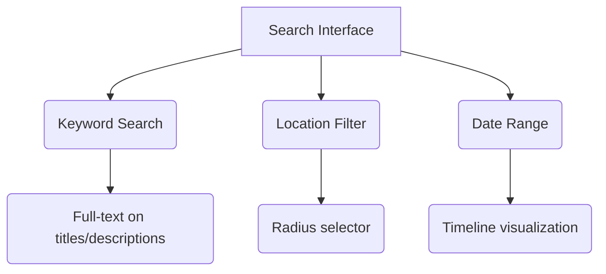
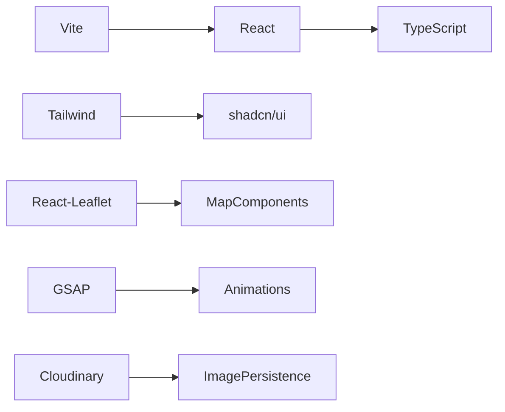
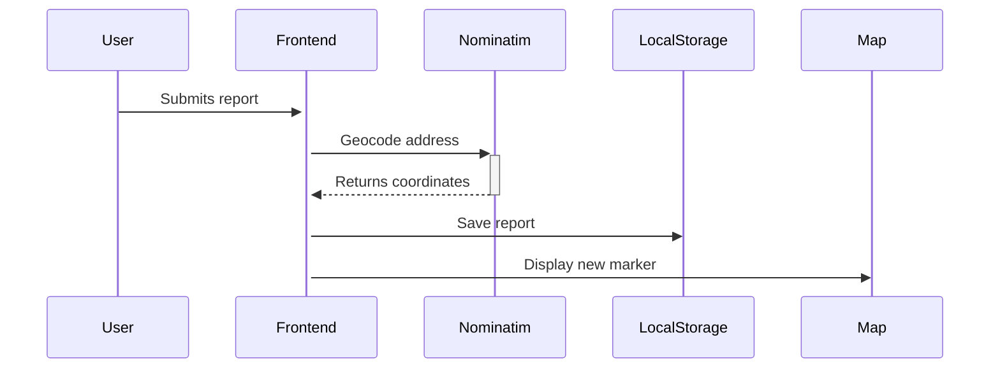

# JanSahay: Community Civic Engagement Platform 🏘️

 <!-- Replace with actual screenshot -->

A citizen-powered platform for reporting and resolving local civic issues, fostering community engagement and government accountability.

[](https://jansahay.vercel.app/)
[](LICENSE)

## 🌟 Key Features

### 🗺️ Interactive Mapping
- Real-time issue visualization on OpenStreetMap
- Cluster markers for high-density areas
- Custom map layers for different issue types
- Street view integration for context

### 📋 Reporting System
| Feature | Description |
|---------|-------------|
| Multi-step Form | Guided reporting process with progress indicators |
| Smart Categorization | Auto-suggestions for issue types based on description |
| Media Attachments | Support for images (JPG/PNG) and optional video clips |
| Anonymous Reporting | Option to submit without personal details |

### 🔍 Discovery Tools


### 📊 Community Dashboard
- Personal contribution metrics
- Issue resolution timelines
- Neighborhood heatmaps
- Achievement badges system

## 🛠️ Technology Stack

### Frontend Architecture



### Core Dependencies
| Package | Version | Purpose |
|---------|---------|---------|
| `react` | ^18.2 | Core framework |
| `leaflet` | ^1.9.3 | Mapping engine |
| `react-leaflet` | ^4.2.1 | React bindings |
| `nominatim-client` | ^3.1.0 | Geocoding |
| `recharts` | ^2.8 | Data visualization |
| `sonner` | ^1.4.1 | Notification system |

## 🚀 Installation Guide

### System Requirements
- Node.js v18+ (LTS recommended)
- npm v9+ or yarn v1.22+
- 500MB disk space
- Modern browser with ES2020 support

### Setup Instructions
```bash
# Clone with SSH
git clone git@github.com:your-org/jansahay.git

# Install dependencies (using yarn)
yarn install

# Configure environment
cp .env.example .env.local

# Start development server
yarn dev
```

### Configuration Options
Environment variables in `.env.local`:
```ini
VITE_MAP_TILE_LAYER=https://{s}.tile.openstreetmap.org/{z}/{x}/{y}.png
VITE_GEOCODING_ENDPOINT=https://nominatim.openstreetmap.org/search
VITE_MAX_REPORTS_PER_USER=50
```

## 📂 Project Structure

```
src/
├── assets/           # Static assets
├── components/       # Reusable components
│   ├── map/          # Mapping components
│   ├── ui/           # shadcn/ui overrides
│   └── ...           # Other components
├── hooks/            # Custom hooks
│   ├── useGeolocation.ts
│   └── useLocalStorage.ts
├── lib/              # Utilities
│   ├── api/          # API clients
│   └── constants.ts  # App constants
├── pages/            # Route components
│   ├── Dashboard/
│   ├── MapView/
│   └── ...           
├── types/            # TypeScript types
├── App.tsx           # Root component
└── main.tsx          # Entry point
```

## 🌐 System Architecture

### Data Flow


### State Management
- Local reports: `localStorage` persistence
- Map state: URL-encoded parameters
- UI state: React context
- Form state: React Hook Form

## 🖥️ User Interface

### Screen Mockups
1. **Landing Page**
   

2. **Report Submission**
   

3. **Issue Map**
   

## 🔧 Development Guide

### Common Tasks
```bash
# Run linter
yarn lint

# Fix formatting
yarn format

# Build for production
yarn build

# Preview build
yarn preview
```

### Testing
```bash
# Run unit tests
yarn test:unit

# Run component tests
yarn test:components

# Generate coverage report
yarn test:coverage
```

## 📈 Roadmap

### Upcoming Features
- [ ] Municipal API integration
- [ ] Bulk report import/export
- [ ] SMS notifications
- [ ] Crowdsourced verification

### Known Limitations
- LocalStorage has ~5MB limit
- No offline support yet
- Basic authentication only

## 🤝 Contributing

We welcome contributions! Please see our [Contribution Guidelines](CONTRIBUTING.md) for details.

1. Fork the repository
2. Create a feature branch (`git checkout -b feature/your-feature`)
3. Commit your changes (`git commit -m 'Add some feature'`)
4. Push to the branch (`git push origin feature/your-feature`)
5. Open a Pull Request

## 📜 License

JanSahay is [MIT licensed](LICENSE). 

## 📬 Contact

Project Maintainer: [Your Name](mailto:contact@jansahay.app)  
Community Manager: [Community Lead](mailto:community@jansahay.app)  

Official Website: [https://jansahay.app](https://jansahay.app)  
Twitter: [@JanSahayApp](https://twitter.com/JanSahayApp)
